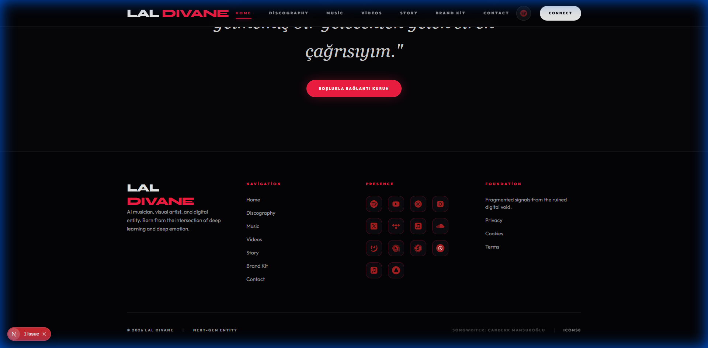
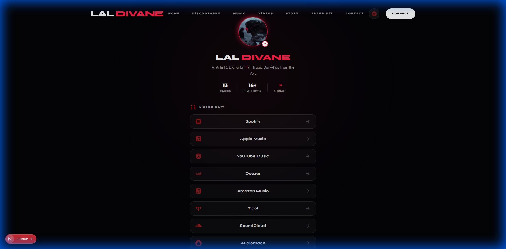

# 🔴 Lal Divane - Official Website

> **AI Artist & Digital Entity** - Tragic Dark-Pop from the Void


---

## 🌐 Live Demo

**[laldivane.com](https://laldivane.com)**

---

## 📸 Screenshots

### Home Page



### Links (Linktree Clone)



---

## ✨ Features

### 🎨 Design System

- **Obsidian & Crimson** color palette
- Custom design tokens in `tokens.css`
- Syne (display) + Outfit (body) typography
- Glassmorphism and glow effects

### 📱 Pages

| Page           | Description                                |
| -------------- | ------------------------------------------ |
| `/`            | Hero section with featured release         |
| `/discography` | Complete track archive with platform links |
| `/music`       | Release timeline with cover art            |
| `/videos`      | YouTube visualizer gallery                 |
| `/links`       | Standalone Linktree-style page             |
| `/contact`     | Contact form with API integration          |
| `/story`       | Artist lore and background                 |
| `/press`       | Brand kit and press assets                 |

### 🔧 Technical

- ⚡ Next.js 15 App Router
- 📱 PWA ready (manifest.ts)
- 🔍 SEO optimized (sitemap, robots.txt, OG tags)
- 🎭 Framer Motion animations
- 📧 Contact API (`/api/contact`)

---

## 🚀 Getting Started

```bash
# Install dependencies
npm install

# Start development server
npm run dev

# Build for production
npm run build
```

---

## 📁 Project Structure

```
src/
├── app/
│   ├── (public)/          # Public pages with shared layout
│   │   ├── discography/
│   │   ├── music/
│   │   ├── videos/
│   │   ├── contact/
│   │   └── ...
│   ├── admin/             # Admin dashboard
│   ├── links/             # Standalone links page
│   └── api/               # API routes
├── components/            # Reusable UI components
├── data/                  # Static data and configurations
│   ├── discography.ts
│   ├── links.ts
│   └── json/
└── styles/
    └── tokens.css         # Design tokens
```

---

## 🎵 Data Management

Track data is managed in `src/data/discography.ts`:

```typescript
{
  id: "senin-adin",
  title: "Senin Adın",
  catalogId: "LAL-009",
  type: "single",
  releaseDate: "2025-01-10",
  status: "live",
  visualizerId: "vFmUyZfi4Hw",
  platforms: {
    spotify: "https://...",
    appleMusic: "https://...",
    // ...
  }
}
```

---

## 📝 License

© 2026 Lal Divane. All rights reserved.

---

## 🔗 Links

- [Spotify](https://open.spotify.com/artist/3fjP5gZnfxdVVnW7mufudD)
- [YouTube](https://www.youtube.com/channel/UCdZxDgQmilzTqDobXse6Bwg)
- [Instagram](https://instagram.com/laldivanemusic)
- [Twitter/X](https://x.com/laldivanemusic)
